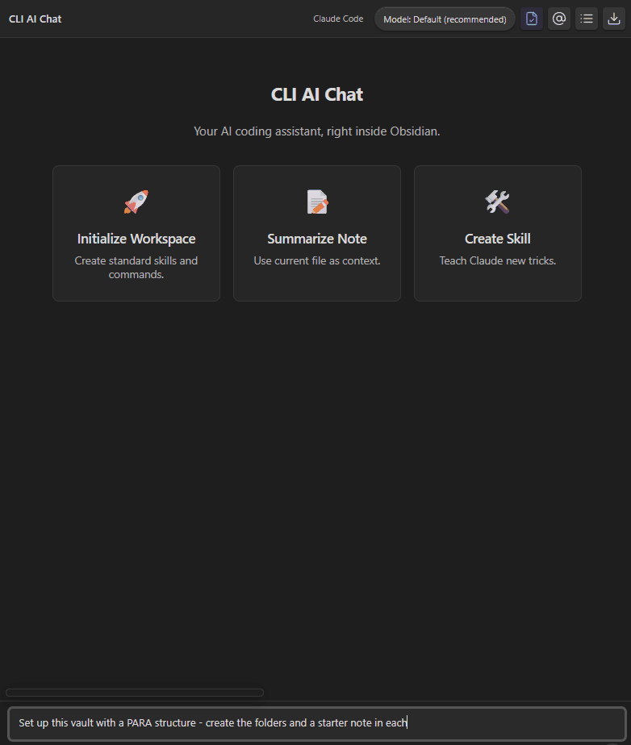

# CLI AI Chat

Your AI coding assistant, right inside Obsidian.



**CLI AI Chat** brings Claude Code's agentic workflow directly into your vault. Ask Claude to read your notes, create files, organize your vault, and build custom automations—all without leaving Obsidian.

## Features

- **@ Mentions** - Reference any file with fuzzy search
- **Tool Transparency** - Watch Claude read, write, and edit in real-time
- **Model Selector** - Switch between Haiku, Sonnet, and Opus
- **Slash Commands** - `/clear`, `/export`, `/context`, `/help`
- **Streaming Responses** - Real-time markdown rendering
- **WSL Support** - Run CLI tools through Windows Subsystem for Linux

## Installation

### From Community Plugins

1. Open **Settings → Community Plugins**
2. Click **Browse** and search for "CLI AI Chat"
3. Click **Install**, then **Enable**
4. Configure your Claude Code binary path in plugin settings

### Beta Installation (BRAT)

1. Install [BRAT](https://github.com/TfTHacker/obsidian42-brat) from Community Plugins
2. Open BRAT settings → **Add Beta Plugin**
3. Enter `kngzzz/cli-ai-chat`
4. Enable the plugin in Community Plugins settings

### Requirements

- [Claude Code CLI](https://claude.ai/code) installed and authenticated
- Obsidian v1.4.0+ (desktop only)

## Quick Start

1. Click the **bot icon** in the left ribbon to open the chat panel
2. Type a message and press **Enter** to send
3. Use `@` to mention files from your vault
4. Watch Claude work with your notes in real-time

### Example Prompts

```
Summarize @daily/2025-11-26.md and suggest priorities
```

```
Set up this vault with a PARA structure
```

```
Create a weekly review template based on my existing notes
```

## Configuration

Access settings via **Settings → CLI AI Chat**

| Setting | Description |
|---------|-------------|
| Binary path | Path to Claude Code CLI (auto-detected if empty) |
| Execution mode | Native or WSL |
| Working directory | Vault folder or custom path |
| Tool display | Full or compact view |
| CLI timeout | Max execution time (default: 45s) |

## Slash Commands

| Command | Action |
|---------|--------|
| `/context on\|off` | Toggle file context |
| `/export` | Export chat to markdown |
| `/clear` | Clear conversation |
| `/mention` | Insert current note |
| `/help` | Show commands |

## Troubleshooting

### CLI not found
- Verify installation: `claude --version`
- Set full path in settings: `/usr/local/bin/claude` or `C:\Users\<you>\AppData\Roaming\npm\claude.cmd`

### WSL errors (Windows)
- Enable **WSL** execution mode in settings
- Vault paths convert automatically (`C:\vault` → `/mnt/c/vault`)

### Timeout errors
- Increase **CLI timeout** in settings for complex tasks

## License

MIT License

## Links

- [GitHub Repository](https://github.com/kngzzz/cli-ai-chat)
- [Claude Code](https://claude.ai/code)
- [Report Issues](https://github.com/kngzzz/cli-ai-chat/issues)

---

Built for the Obsidian community.
